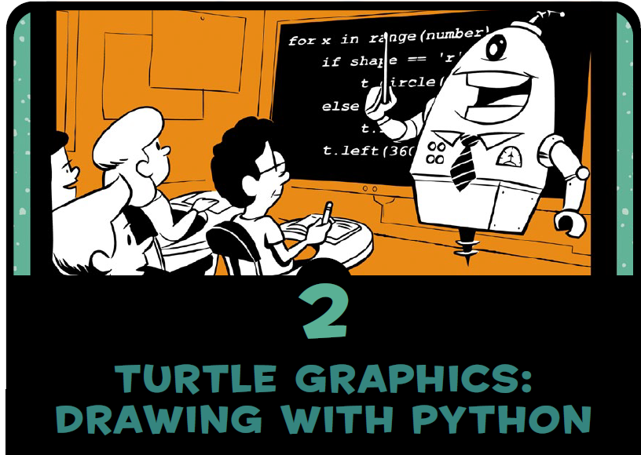
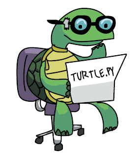
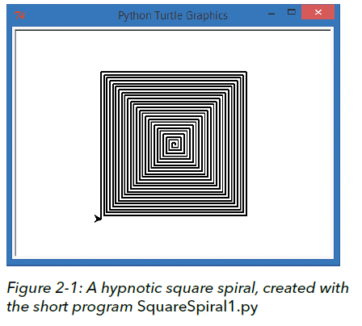
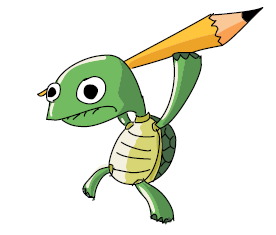

```
Created on Sat May 11 23:17:01 2019  
@author: molychin@qq.com  
Teach Your Kids to Code  
```  

---  
## **Teach Your Kids to Code 002**
### Turtle Graphics:Drawing with Python



In this chapter, we’ll write short, simple programs to create beautifully complex visuals. To do this, we’ll use turtle graphics. In turtle graphics, you write instructions that tell a virtual, or imaginary, turtle to move around the screen. The turtle carries a pen, and you can instruct the turtle to use its pen to draw lines wherever it goes. By writing code to move the turtle around in cool patterns, you can make it draw amazing pictures.

在这一章中，我们将编写简短、简单的程序来创建漂亮、复杂的视觉图形。为此，我们将使用乌龟图形。在乌龟图形中，你写指令告诉一只虚拟的或虚构的乌龟在屏幕上移动。乌龟带着一支钢笔，你可以指示乌龟用它的钢笔在任何地方画线。通过编写代码以酷的模式移动乌龟，你可以让它画出令人惊叹的图片。

Using turtle graphics, not only can you create impressive visuals with a few lines of code, but you can also follow along with the turtle and see how each line of code affects its movement. This will help you understand the logic of your code.

使用Turtle图形，不仅可以用几行代码创建令人印象深刻的视觉图形，而且还可以跟随Turtle，查看每一行代码如何影响其移动。这将帮助您理解代码的逻辑。  

  
```python
# SquareSpiral1.py - Draws a square spiral
import turtle
t = turtle.Pen()
for x in range(100):
    t.forward(x)
    t.left(90)
```


>背景知识：Logo语言  
The Logo programming language was created in 1967 as an educational programming language, and five decades later, it’s still useful for learning the basics of coding. Cool, huh?  
  
logo编程语言`【也称为海龟绘图】`创建于1967年，是一种教育性编程语言，五十年后，它仍然有助于学习编码的基础知识。很酷，是吧？  
python语言的内置类库包turtle正是模仿logo语言的绘图工具包，用法几乎和logo一样。


>continue
