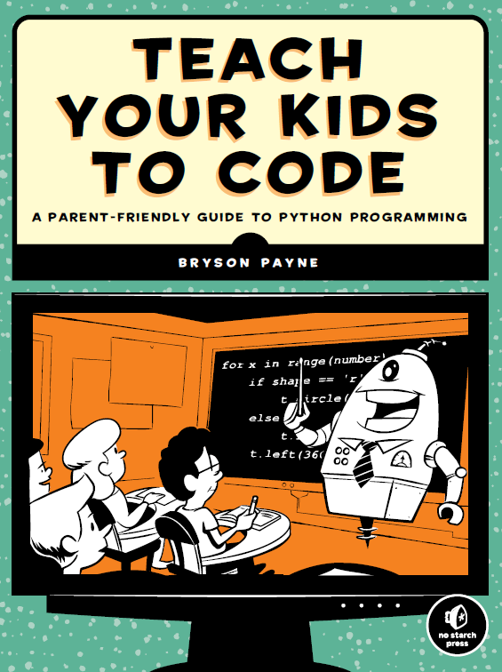
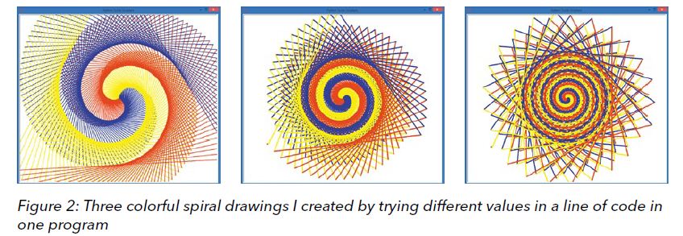
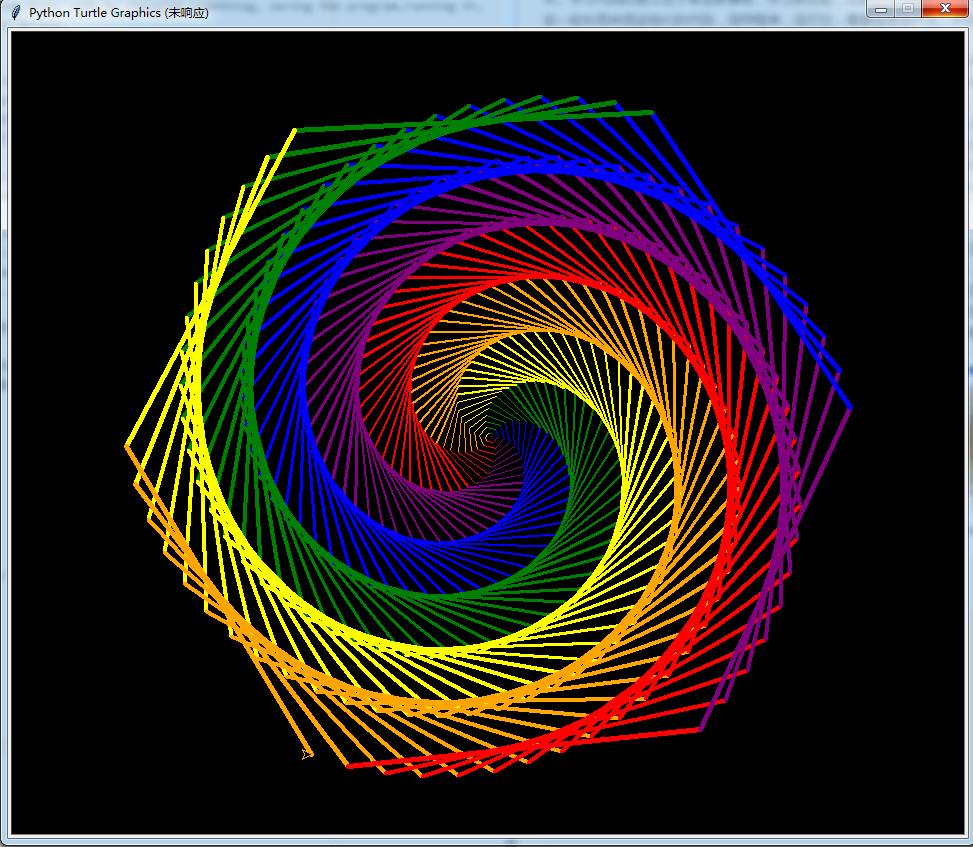
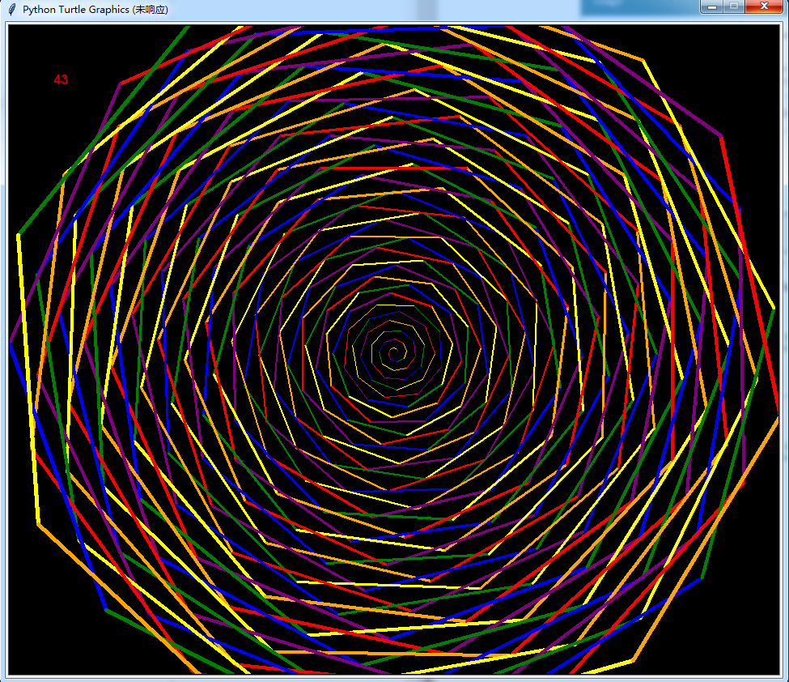
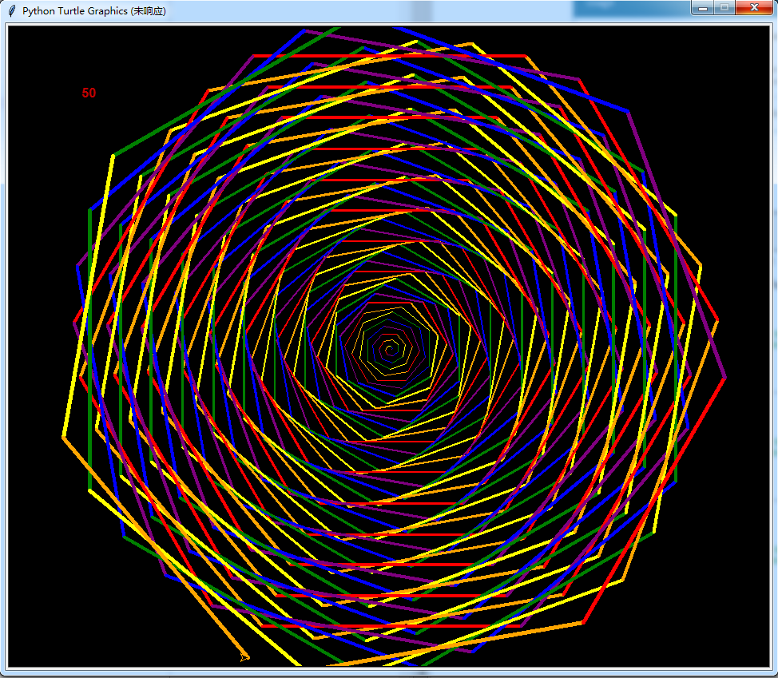
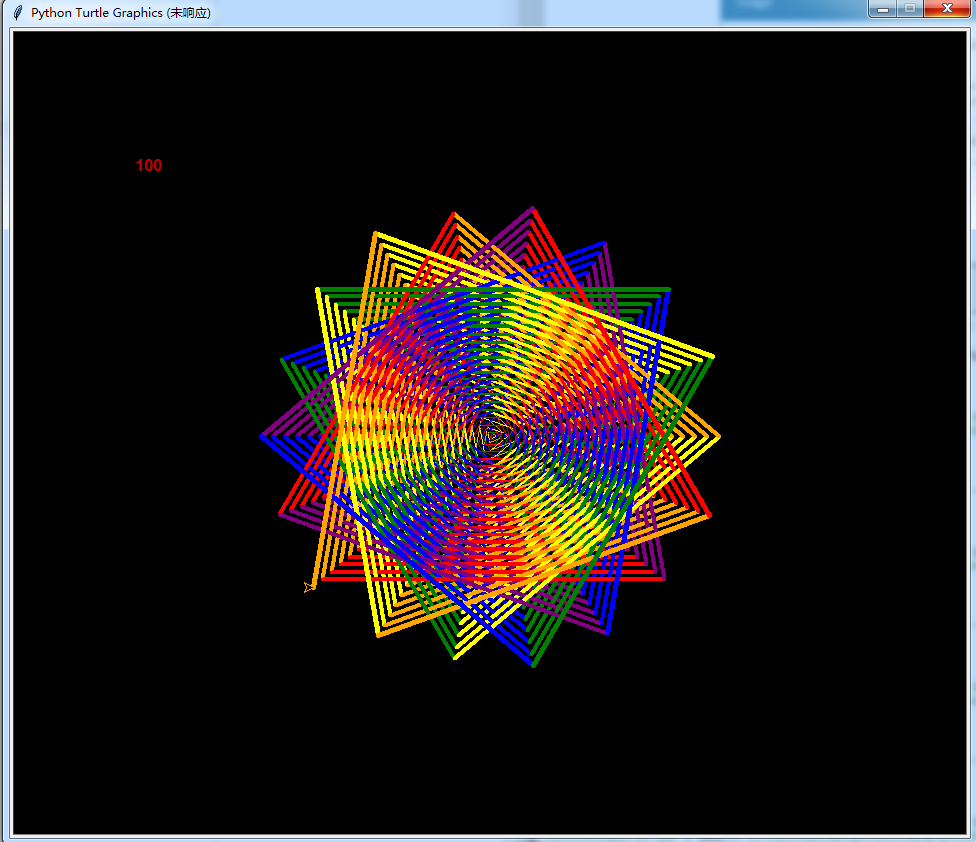
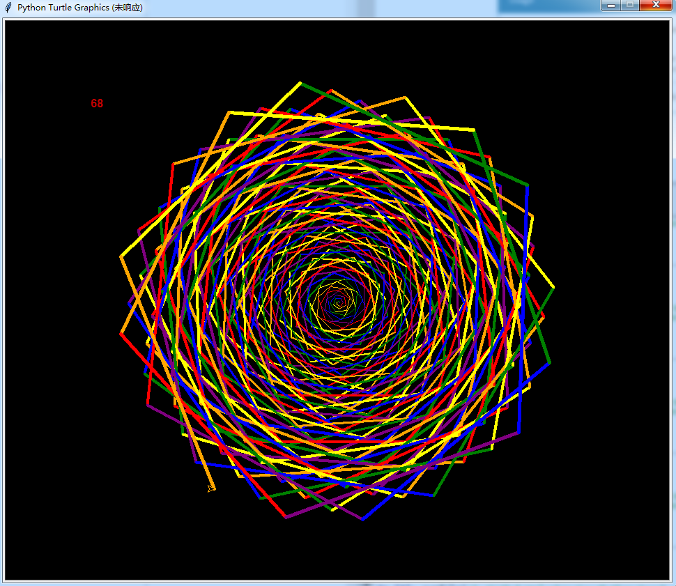
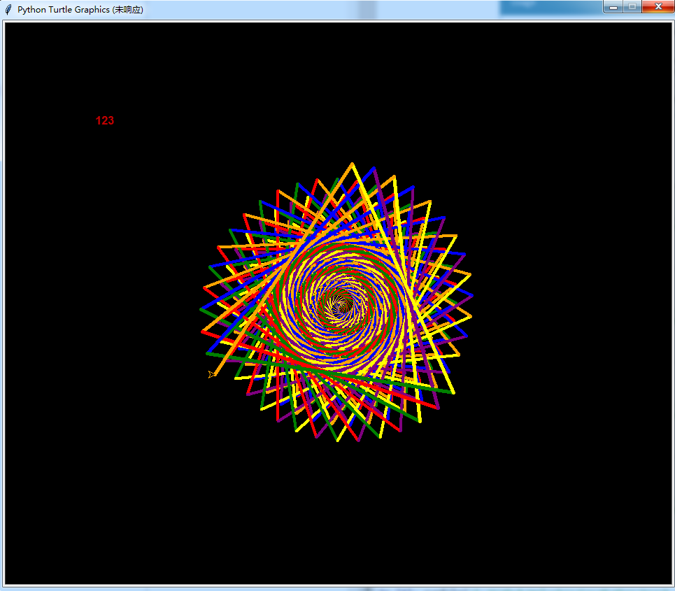

```
Created on Sat May 11 23:17:01 2019  
@author: molychin@qq.com  
Teach Your Kids to Code  
```  

---  
## **Teach Your Kids to Code**



Computer programming, or coding, is a crucial skill every child should be learning. We use computers to solve problems, play games, help us work more effectively, perform repetitive tasks, store and recall information, create something new, and connect with our friends and the world. Understanding how to code puts all this power at our fingertips.

计算机编程，或编码，是每个孩子都应该学习的关键技能。我们使用计算机来解决问题，玩游戏，帮助我们更有效地工作，执行重复的任务，存储和回忆信息，创造新的东西，并与我们的朋友和世界联系。了解如何编写代码使我们掌握了所有这些能力。

We are at an unprecedented time in history: never before could billions of people connect with one another every day like we do now with computers. We live in a world of many new possibilities, from electric cars and robot caregivers to drones that deliver packages and even pizza.

我们正处在历史上前所未有的时刻：以前，数十亿人每天都无法像现在使用计算机那样相互联系。我们生活在一个充满各种新可能性的世界里，从电动汽车和机器人看护者到运送包裹甚至披萨的无人机。

>请例举计算机在生活中的应用；  
你在生活中，都使用计算机来做什么了？  
你觉得还有什么是计算机做不到的；  
你对（不久）将来人类和计算机的关系有什么看法？  
你觉得计算机（编程）对现在的人是必备的技能吗？  
你对学习计算机语言（编程）有兴趣吗？
- [x]有兴趣
- [x]没有兴趣


**Coding Is Fun**  
Technology is becoming a part of everyday life. Every company, charitable organization, and cause can benefit from technology.There are apps to help you buy, give, join, play, volunteer, connect,share—just about anything you can imagine.
Have your children wanted to build their own level for their favorite video game? Coders do that! What about create their own phone app? They can bring that idea to life by programming it on a computer! Every program, game, system, or app they’ve ever seen was coded using the same programming building blocks they’ll learn in this book. When kids program, they take an active role in technology—they’re not just having fun, they’re making something fun!

**编码是很酷的事情**  
科技正在成为日常生活的一部分。每一家公司、慈善组织和事业都可以从技术中受益。有一些应用程序可以帮助你购买、捐赠、加入、玩、志愿、连接、分享你所能想象的一切。  
你的孩子想为他们最喜欢的电子游戏建立自己的水平吗？编码员就这么做！创建自己的手机应用程序怎么样？他们可以通过在电脑上编程来实现这个想法！他们所见过的每一个程序、游戏、系统或应用程序都是用他们将在本书中学习的相同编程构建块进行编码的。当孩子们参与项目的时候，他们在技术上扮演着积极的角色，他们不仅仅是在玩，他们在做一些有趣的事情！

**Coding Is a Valuable Job Skill**  
Coding is the skill of the 21st century. Jobs today require more problem-solving ability than ever before, and more and more careers involve technology as an integral requirement.

**编码是一项宝贵的工作技能**  
编码是21世纪的技术。如今的工作比以往任何时候都需要更多的解决问题的能力，越来越多的职业将技术作为一项不可或缺的要求。

**Explore!**  
Learning to program is exciting if you’re willing to try new things.As you and your kids follow along with the programs in this book, try changing numbers and text in the code to see what happens to the program. Even if you break it, you’ll learn something new by fixing it. In the worst case, all you have to do is retype the example from the book or open the last saved version that worked. The point of learning to code is to try something new, learn a new skill, and solve problems in a new way. Make sure your kids are playing around—testing their code by changing something, saving the program,running it, seeing what happens, and fixing any errors.

**探索！**   
如果你愿意尝试新事物，学习编程是令人兴奋的。当你和你的孩子跟随这本书中的程序时，试着改变代码中的数字和文本，看看程序会发生什么。即使你把它弄坏了，你也会通过修理它学到一些新东西。在最坏的情况下，您所要做的就是从书中重新输入示例，或者打开上次保存的有效版本。学习代码的意义在于尝试新事物，学习新技能，以新的方式解决问题。确保你的孩子通过改变一些东西来测试他们的代码，保存程序，运行它，看看会发生什么，并修复任何错误。

The point of learning to code is to try something new, learn a new skill, and solve problems in a new way. Test your code by changing something, saving the program, running it, seeing what happens, and fixing errors if needed.  
For example, I wrote some code to make a colorful drawing (Figure 2) and then went back, changed some numbers here and there, and tried running the program again. This gave me another drawing that was completely different but just as amazing. I went back again, changed some other numbers, and got yet another beautiful, unique drawing. See what you can do just by playing around?   

学习代码的意义在于尝试新事物，学习新技能，以新的方式解决问题。通过更改某些内容、保存程序、运行程序、查看发生的情况以及修复错误（如果需要）来测试代码。  
例如，我编写了一些代码来绘制一个彩色的图形（图2），然后返回，在这里和那里更改了一些数字，并尝试再次运行该程序。这给了我另一幅完全不同但同样令人惊叹的画。我又回去了，换了一些其他的数字，得到了另一幅美丽独特的画。看看你只需要四处玩玩就能做什么？



##### 画一个很漂亮的螺旋六边形
```python
#NiceHexSpiral.py
import turtle   
colors=['red', 'purple', 'blue',
        'green', 'yellow', 'orange']
t=turtle.Pen()
turtle.bgcolor('black')
for x in range(360):
    t.pencolor(colors[x%6])
    t.width(x/100+1)
    t.forward(x)        
    t.left(59)
```



>好好研究turtle的图形生成法则，可以找出很多（自然界）图形的生成规律【其实没有看上去那么复杂】。整理出一片文章专门讨论这个问题。  

| 1 | 2 | 3 |
|---|---|---|
||||
||||


continue
