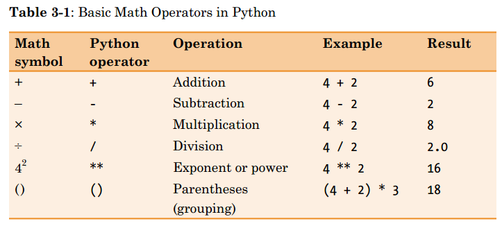

```
Created on Sat May 11 23:17:01 2019  
@author: molychin@qq.com  
Teach Your Kids to Code  
```  

---
## **Teach Your Kids to Code 003**
### Numbers aNd Variables:PythoN does the math

```python
#ThankYou.py
my_name = "Bryson"
my_age = 43
your_name = input("What is your name? ")
your_age = input("How old are you? ")
print("My name is", my_name, ", and I am", my_age, "years old.")
print("Your name is", your_name, ", and you are", your_age, ".")
print("Thank you for buying my book,", your_name, "!")
```

#### 变量说明


**syntax errors: What did you say?**  
While we’re typing in the Python shell, we have a chance to learn about syntax errors. Whenever Python, or any programming language, can’t understand the command you typed, it may respond with a message like "Syntax Error". This means there was a problem with the way you asked the computer to do something, or your syntax.  
Syntax is the set of rules we follow in building sentences or statements in a language. When we program computers, we call a mistake in a statement a syntax error; when we make a mistake  in a sentence in English, we might call it bad grammar. The difference is that, unlike English speakers, computers can’t understand  bad grammar at all. Python, like most programming languages,is very good at performing calculations as long as we follow syntax rules, but it can’t understand anything we’re saying if we mess up  the syntax. Take a look at Figure 3-3 to see some examples of syntax errors, followed by the expressions stated in a way that Python  can understand.

**语法错误：你说什么？**  
当我们在python shell中输入时，我们会遇到语法错误。每当python或任何编程语言无法理解您输入的命令时，它可能会以“语法错误”之类的消息响应【反馈】。这意味着你要求计算机做某些事情的方式或语法有问题。  
语法是我们在用一种语言构建句子或语句时遵循的一套规则。当我们编写计算机程序时，我们把语句中的一个错误称为语法错误；当我们用英语把一个句子中的一个错误称为语法错误。区别在于，不同于说英语的人，电脑根本无法理解糟糕的语法。Python与大多数编程语言一样，只要遵循语法，就非常擅长执行计算规则，但是如果我们把语法搞乱了，它就不能理解我们说的任何东西。看一下图3-3，可以看到一些语法错误的例子，后面是以Python可以理解的方式声明的表达式。


>**计算机的理解力**  
计算机不能容忍任何错误，哪怕是基本的拼写错误。这也是目前计算机还有提高的地方，他不能根据语境的上下文来揣摩谈话对象的语言含义。也许，在不久的将来，计算机会像人类一样，能够理解文字的不同含义和含糊表达。


>continue
