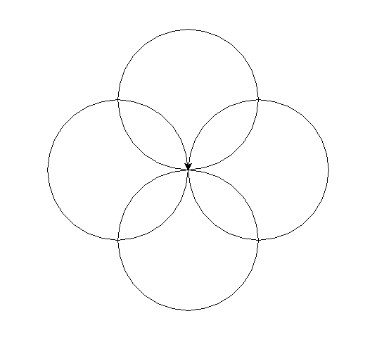

```
Created on Sat May 11 2019.05.13.20:42
@author: molychin@qq.com  
Teach Your Kids to Code  
```  

---
## **Teach Your Kids to Code 004**
### Loops Are Fun (You Can Say That Again)


#### ■围绕中心的四个圆  
```python
#Rosette.py
import turtle
t = turtle.Pen()
t.circle(100) # This makes our first circle (pointing north)
t.left(90)    # Then the turtle turns left 90 degrees
t.circle(100) # This makes our second circle (pointing west)
t.left(90)    # Then the turtle turns left 90 degrees
t.circle(100) # This makes our third circle (pointing south)
t.left(90)    # Then the turtle turns left 90 degrees
t.circle(100) # This makes our fourth circle (pointing east)
```


代码虽然比较简单，但是好像有重复之嫌。程序员是最喜欢 **偷懒** 的人群，那么可以作出怎样的改变来 **简化** 这个小程序呢？`【例如，我们要考虑如果需要画几百个圆来构成一幅图形，我们就不能用上面这样原始的笨方法了，下面就有改进的示例。】`使用 **循环语句** 是个很好的选择！


>continue...  - p55
