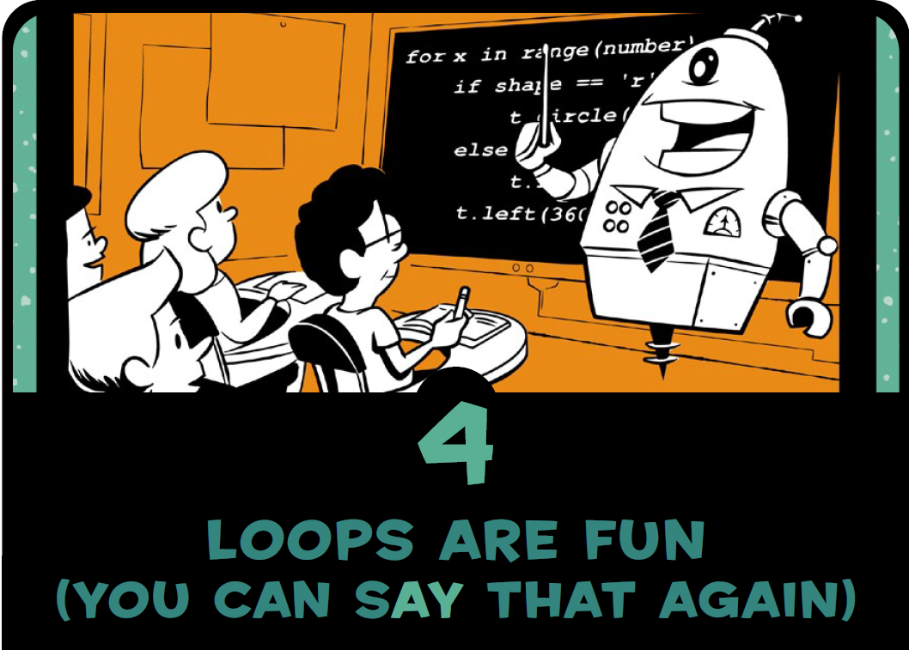

```
Created on Sat May 11 2019.05.13.20:42
@author: molychin@qq.com  
Teach Your Kids to Code  
```  

---
## **Teach Your Kids to Code 004**
### Loops Are Fun (You Can Say That Again)



#### ■围绕中心的四个圆  
```python
#Rosette.py
import turtle
t = turtle.Pen()
t.circle(100) # This makes our first circle (pointing north)
t.left(90)    # Then the turtle turns left 90 degrees
t.circle(100) # This makes our second circle (pointing west)
t.left(90)    # Then the turtle turns left 90 degrees
t.circle(100) # This makes our third circle (pointing south)
t.left(90)    # Then the turtle turns left 90 degrees
t.circle(100) # This makes our fourth circle (pointing east)
```


代码虽然比较简单，但是好像有重复之嫌。程序员是最喜欢 **偷懒** 的人群，那么可以作出怎样的改变来 **简化** 这个小程序呢？`【例如，我们要考虑如果需要画几百个圆来构成一幅图形，我们就不能用上面这样原始的笨方法了，下面就有改进的示例。】`使用 **循环语句** 是个很好的选择！


```python
# Rosette6.py
import turtle
t = turtle.Pen()
for x in range(6):
    t.circle(100)
    t.left(60)
```


```python
# RosetteGoneWild.py
import turtle
t = turtle.Pen()
# Ask the user for the number of circles in their rosette, default to 6
number_of_circles = int(turtle.numinput("Number of circles",
                                        "How many circles in your rosette?", 6))
for x in range(number_of_circles):
    t.circle(100)
    t.left(360/number_of_circles)
```

|edges=16|edges=200|
|:---:|:---:|
|||

```python
# ViralSpiral.py - a spiral of spirals!
import turtle
t = turtle.Pen()
t.penup()
turtle.bgcolor("black")
turtle.Turtle().screen.delay(0)   #绘画没有延迟

# Ask the user for the number of sides, default to 4, min 2, max 6
sides = int(turtle.numinput("Number of sides",
            "How many sides in your spiral of spirals? (2-6)", 4,2,6))
colors = ["red", "yellow", "blue", "green", "purple", "orange"]
# Our outer spiral loop
for m in range(100):
    t.forward(m*4)
    position = t.position() # Remember this corner of the spiral
    heading = t.heading()   # Remember the direction we were heading
#    print(position, heading)
    # Our "inner" spiral loop
    # Draws a little spiral at each corner of the big spiral
    for n in range(int(m/2)):
        t.pendown()
        t.pencolor(colors[n%sides])
        t.forward(2*n)
        t.right(360/sides - 2)
        t.penup()

    t.setx(position[0])     # Go back to the big spiral's x location
    t.sety(position[1])     # Go back to the big spiral's y location
    t.setheading(heading)   # Point in the big spiral's heading
    t.left(360/sides + 2)   # Aim at the next point on the big spiral

```

|edges=2|edges=3|
|:---:|:---:|
|||
|edges=4|edges=5|
|||
|edges=6|edges=?|
|||


>continue...  - p55
