```
Created on Sat May 11 2019.05.13.20:42
@author: molychin@qq.com  
Teach Your Kids to Code  
```  

---
## **Teach Your Kids to Code 005**
### Conditions (What If?)

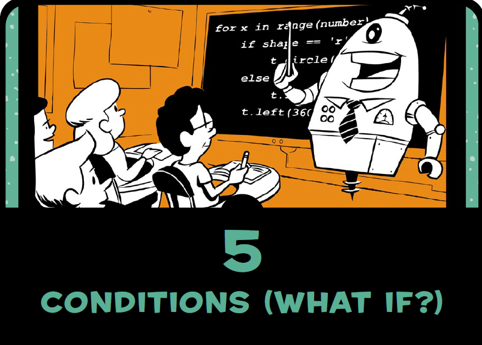

```python
answer = input("Do you want to see a spiral? y/n:")
if answer == 'y':
    print("Working...")
    import turtle
    t = turtle.Pen()
    t.width(2)
    for x in range(100):
        t.forward(x*2)
        t.left(89)
print("Okay, we're done!")

```

left=71  
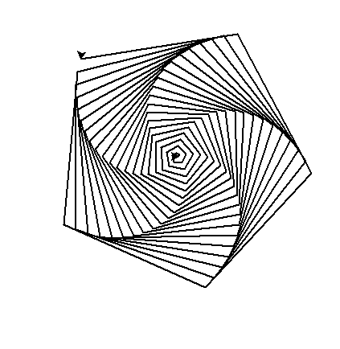

left=72  
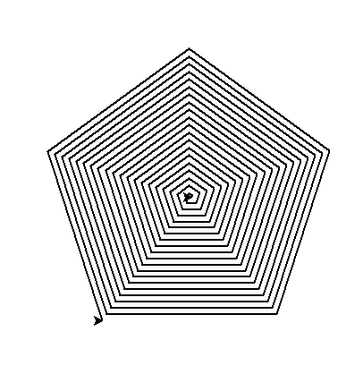

left=73  
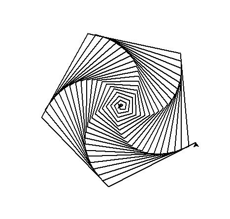

left=74  
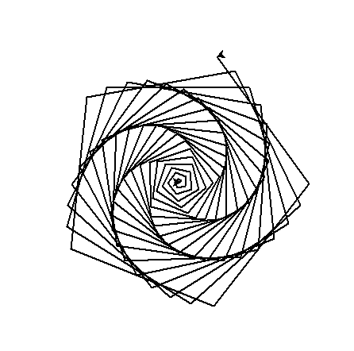

left=89  
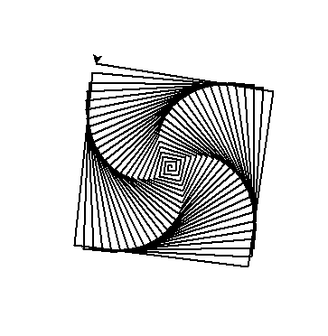

left=90  
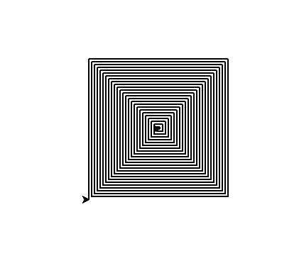

left=90.1  
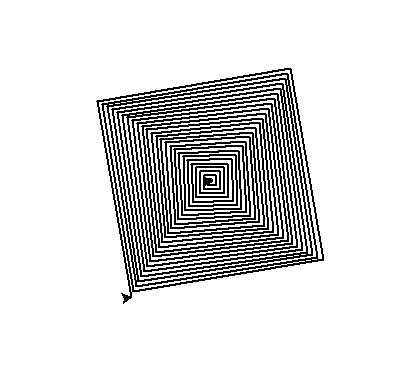

left=90.2  
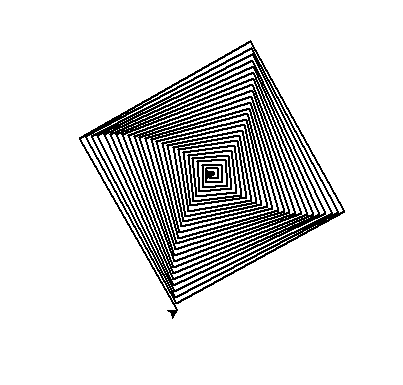

left=90.3  


left=90.5  
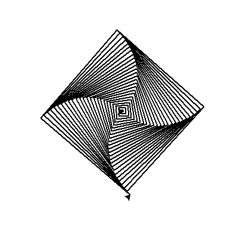

left=91  
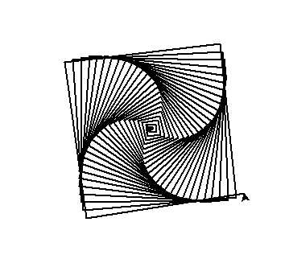

left=92   
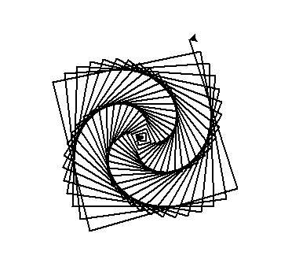

left=93  
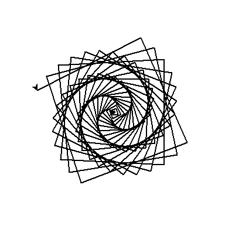

left=95  
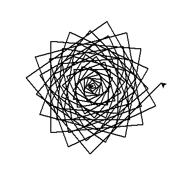

left=100  
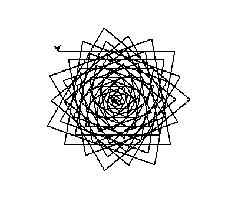

left=110  
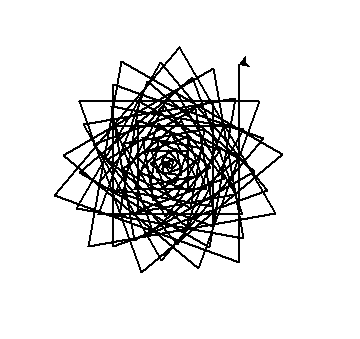

left=115  
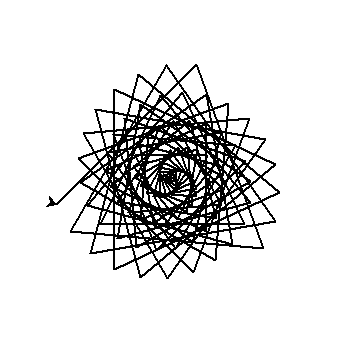

left=117  
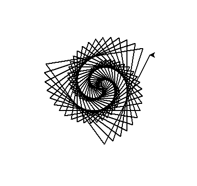

left=118  
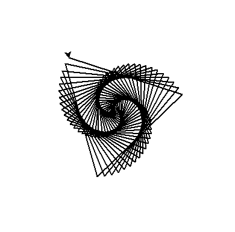

left=119  
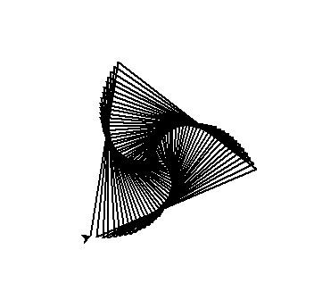

left=119.5  
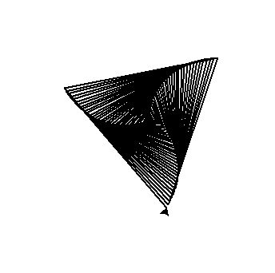

left=120  
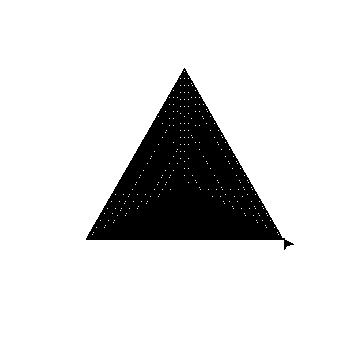


>continue...  - p55
