```
Created on Sat May 11 2019.05.13.20:42
@author: molychin@qq.com  
Teach Your Kids to Code  
```  

---
## **Teach Your Kids to Code 005**
### Conditions (What If?)


```python
answer = input("Do you want to see a spiral? y/n:")
if answer == 'y':
    print("Working...")
    import turtle
    t = turtle.Pen()
    t.width(2)
    for x in range(100):
        t.forward(x*2)
        t.left(89)
print("Okay, we're done!")

```

|left=71|left=72|left=72.5|
|:---:|:---:|:---:|
|||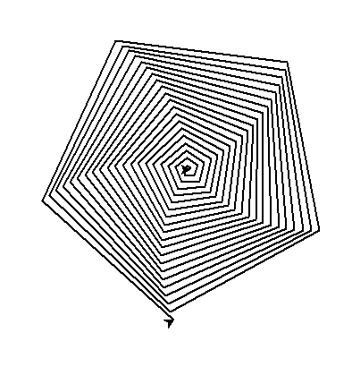|
|left=73|left=74|left=79|
|||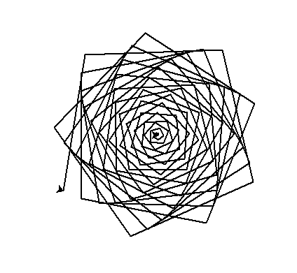|
|left=80|left=81|left=85|
|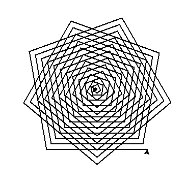|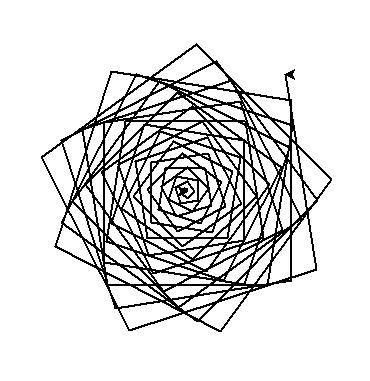|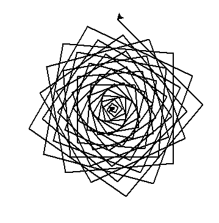|
|left=88|left=89|left=90|
|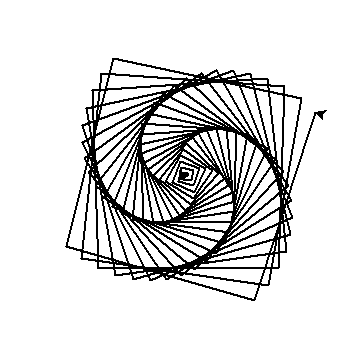|||
|left=90.1|left=90.2|left=90.3|
||||
|left=90.5|left=91|left=92|
||||
|left=93|left=95|left=100|
||||
|left=110|left=115|left=117|
||||
|left=118|left=119|left=119.5|
||||
|left=120|left=121|left=130|
||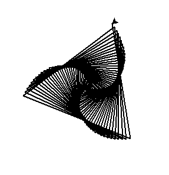|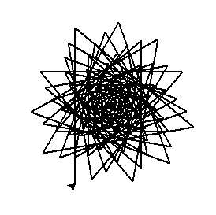|

最初的几步：  
left=89  
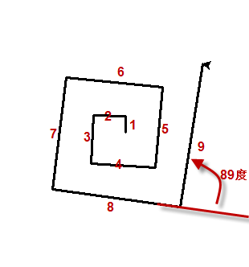


```python
# PolygonOrRosette.py
import turtle
t = turtle.Pen()
# Ask the user for the number of sides or circles, default to 6
number = int(turtle.numinput("Number of sides or circles",
             "How many sides or circles in your shape?", 6))
# Ask the user whether they want a polygon or rosette
shape = turtle.textinput("Which shape do you want?",
                         "Enter 'p' for polygon or 'r' for rosette:")
for x in range(number):
    if shape == 'r':        # User selected rosette
        t.circle(100)
    else:                   # Default to polygon
        t.forward (150)
    t.left(360/number)

```


```python
# RosettesAndPolygons.py - a spiral of polygons AND rosettes!
import turtle
t = turtle.Pen()
# Ask the user for the number of sides, default to 4
sides = int(turtle.numinput("Number of sides",
            "How many sides in your spiral?", 4))
# Our outer spiral loop for polygons and rosettes, from size 5 to 75
for m in range(5,75):   
    t.left(360/sides + 2)
    t.width(m//25+1)
    t.penup()        # Don't draw lines on spiral
    t.forward(m*4)   # Move to next corner
    t.pendown()      # Get ready to draw
    # Draw a little rosette at each EVEN corner of the spiral
    if (m % 2 == 0):
        for n in range(sides):
            t.circle(m/3)
            t.right(360/sides)
    # OR, draw a little polygon at each ODD corner of the spiral
    else:
        for n in range(sides):
            t.forward(m)
            t.right(360/sides)

```

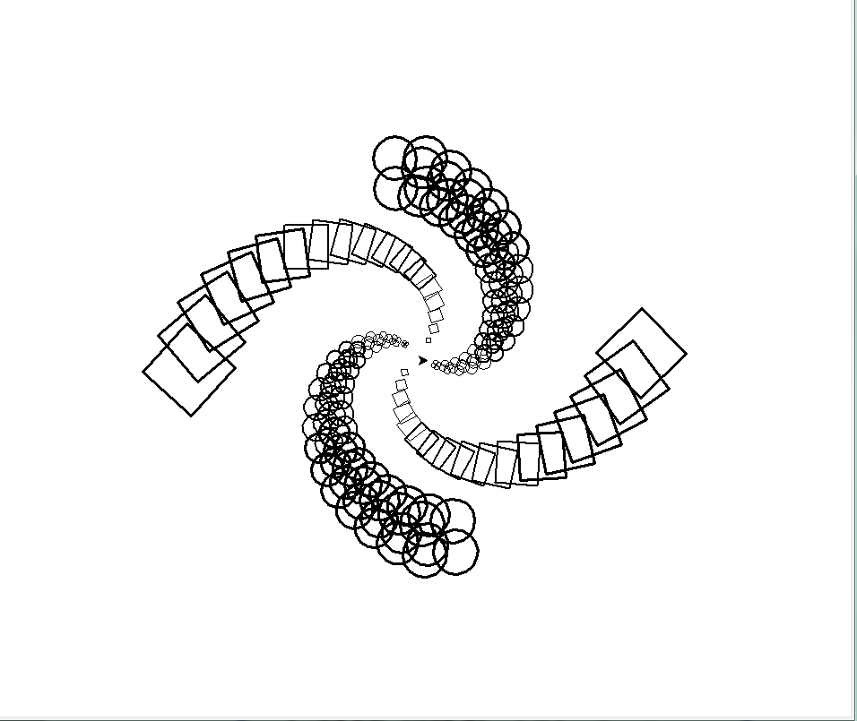

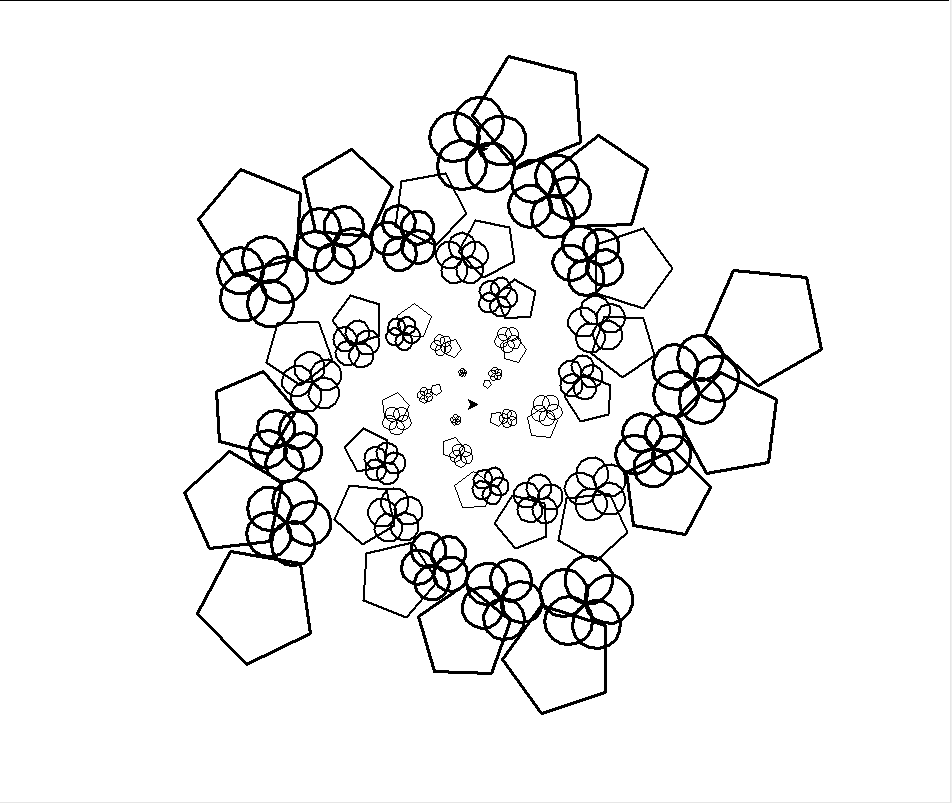


>continue...  - p55
