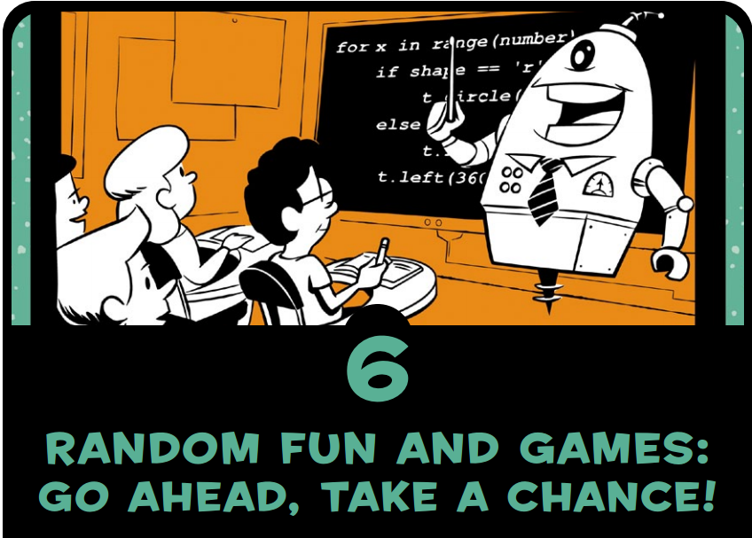
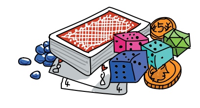
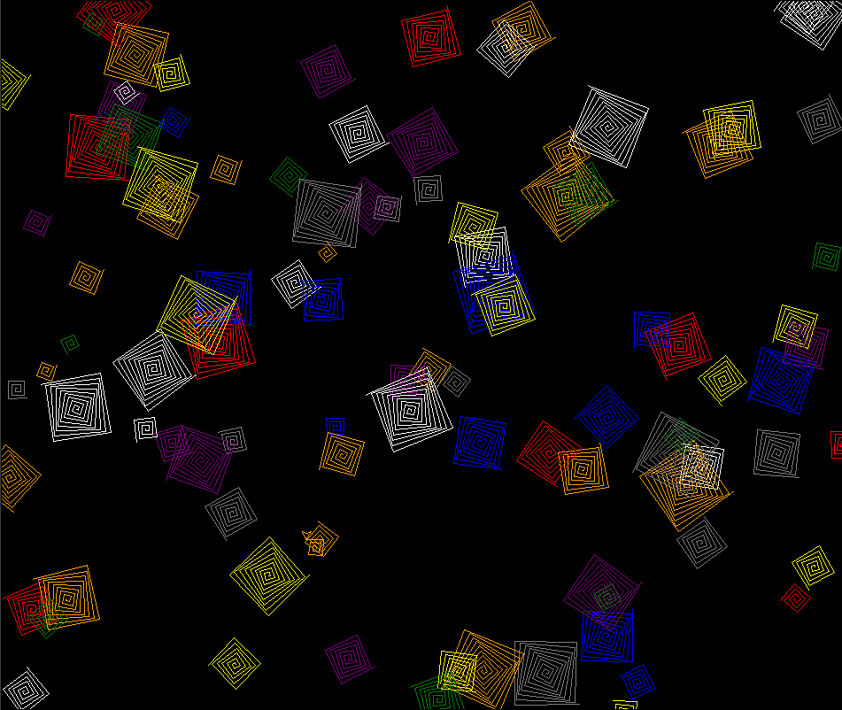
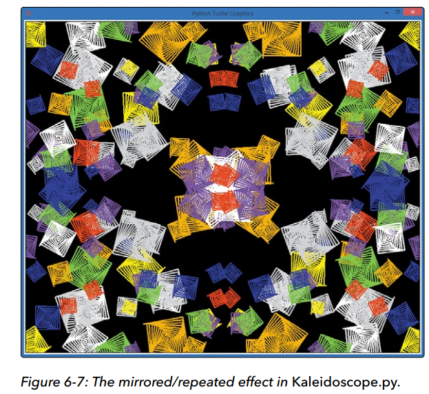

```
Created on Sat May 11 2019.05.13.20:42
@author: molychin@qq.com  
Teach Your Kids to Code  
```  

---
## **Teach Your Kids to Code 006**
### Random Fun and Games:Go ahead, Take a ChanCe!




The common element in these games is the idea of randomness.We want the computer to pick a number at random between 1 and 10, and we guess what that number is. We want the computer to randomly pick rock, paper, or scissors, and then we choose what to play and see who wins. These examples—plus dice games, card games, and so on—are called games of chance. When we roll five dice to play Yahtzee, we usually get a different result every time we roll. That element of chance is what makes these games fun.

这些游戏中常见的元素是随机性的概念，我们希望计算机随机选择一个1到10之间的数字，我们猜这个数字是什么。我们希望电脑随机挑选石头、纸或剪刀，然后我们选择玩什么，看看谁赢。这些例子加上骰子游戏、纸牌游戏等等，被称为机会游戏。当我们掷五个骰子玩yahtzee时，我们每次掷骰子都会得到不同的结果。机会的因素就是这些游戏的乐趣所在。



```python
#GuessingGame.py
import random
the_number = random.randint(1, 10)
guess = int(input("Guess a number between 1 and 10: "))
while guess != the_number:
    if guess > the_number:
        print(guess, "was too high. Try again.")
    if guess < the_number:
        print(guess, "was too low. Try again.")
    guess = int(input("Guess again: "))
print(guess, "was the number! You win!")
```


```python
#RandomSpirals.py
import random
import turtle
t = turtle.Pen()
turtle.bgcolor("black")
colors = ["red", "yellow", "blue", "green", "orange", "purple",
          "white", "gray"]
for n in range(50):
    # Generate spirals of random sizes/colors at random locations
    t.pencolor(random.choice(colors))   # Pick a random color
    size = random.randint(10,40)        # Pick a random spiral size
    # Generate a random (x,y) location on the screen
    x = random.randrange(-turtle.window_width()//2,
                         turtle.window_width()//2)
    y = random.randrange(-turtle.window_height()//2,
                         turtle.window_height()//2)
    t.penup()
    t.setpos(x,y)
    t.pendown()
    for m in range(size):
        t.forward(m*2)
        t.left(91)
```



```python
#Kaleidoscope.py
import random
import turtle
t = turtle.Pen()
#t.speed(0)
turtle.Turtle().screen.delay(0)   #绘画没有延迟
turtle.bgcolor("black")
colors = ["red", "yellow", "blue", "green", "orange", "purple", "white", "gray"]
for n in range(50):
    # Generate spirals of random sizes/colors at random locations on the screen
    t.pencolor(random.choice(colors))   # Pick a random color from colors[]
    size = random.randint(10,40)        # Pick a random spiral size from 10 to 40
    # Generate a random (x,y) location on the screen
    x = random.randrange(0,turtle.window_width()//2)
    y = random.randrange(0,turtle.window_height()//2)
    # First spiral
    t.penup()
    t.setpos(x,y)
    t.pendown()
    for m in range(size):
        t.forward(m*2)
        t.left(91)
    # Second spiral
    t.penup()
    t.setpos(-x,y)
    t.pendown()
    for m in range(size):
        t.forward(m*2)
        t.left(91)    
    # Third spiral
    t.penup()
    t.setpos(-x,-y)
    t.pendown()
    for m in range(size):
        t.forward(m*2)
        t.left(91)
    # Fourth spiral
    t.penup()
    t.setpos(x,-y)
    t.pendown()
    for m in range(size):
        t.forward(m*2)
        t.left(91)

```




>continue...  - p106
