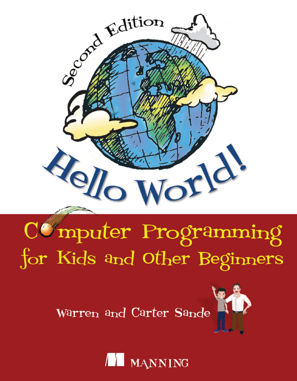
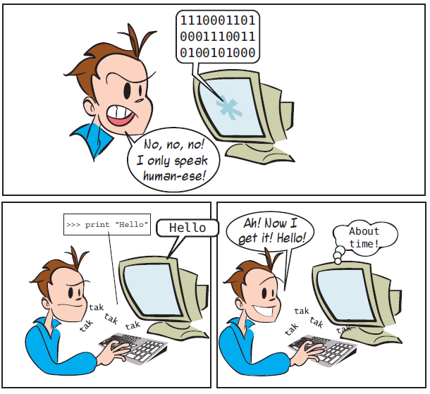
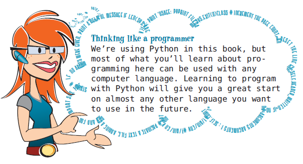
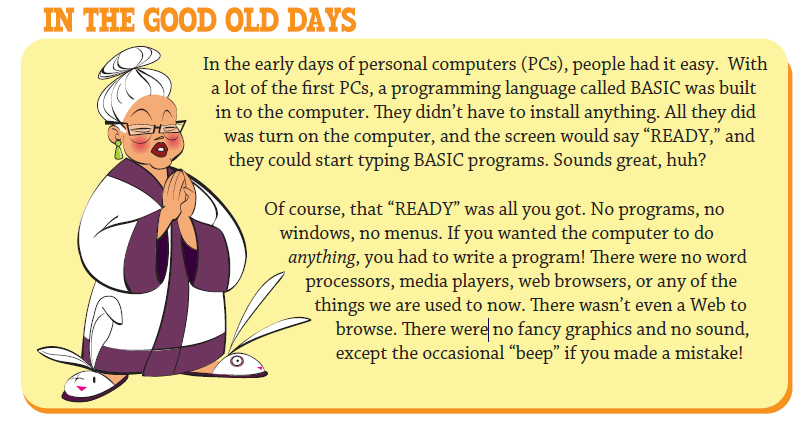
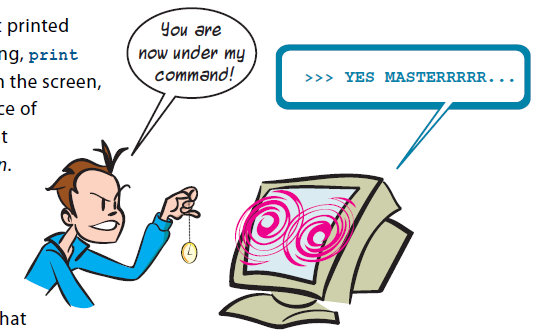

"""
Created on Sat May 11 23:17:01 2019

@author: molychin@qq.com
programming_for_kids
"""

## Computer Programming for Kids and Other Beginners


What is programming?  
Very simply, programming means telling a computer to do something. Computers are dumb machines. They don’t know how to do anything. You have to tell them everything, and you have to get all the details right.

什么是编程？  
很简单，编程意味着让计算机做一些事情。计算机是愚蠢的机器。他们什么都不知道。你必须把一切都告诉他们，而且你必须把所有的细节都弄好。

A computer program is made up of a number of instructions. Computers do all the great things they do today because a lot of smart programmers wrote programs or software to tell them how. Software just means a program or collection of programs that run on your computer, or sometimes on another computer yours is connected to, like a web server.

计算机程序由许多指令组成。计算机做了他们今天做的所有伟大的事情，因为许多聪明的程序员写程序或软件告诉他们如何做。软件只是指在您的计算机上运行的程序或程序集合，有时也指您连接到的另一台计算机上运行的程序或程序集合，如Web服务器。

Python—a language for us and the computer  
All computers use binary inside. But most people don’t speak binary very well. We need an easier way to tell the computer what we want it to do. So people invented programming languages. A computer programming language lets us write things in a way we can understand, and then translates that into binary for the computer to use.

python——我们和计算机的语言  
所有计算机内部都使用二进制。但大多数人不会很好地说二进制。我们需要一种更简单的方法来告诉计算机我们想要它做什么。所以人们发明了编程语言。计算机编程语言可以让我们以一种我们能理解的方式来写东西，然后把它翻译成二进制供计算机使用。



Why learn programming?  
Even if you don’t become a professional programmer (most people don’t), there are lots of reasons to learn programming:  
■ The most important is because you want to! Programming can be very interesting and rewarding, as a hobby or a profession.  
■ If you’re interested in computers and want to know more about how they work and how you can make them do what you want, that’s a good reason to learn about programming.  
■ Maybe you want to make your own games, or maybe you can’t find a program that does exactly what you want or need it to do, so you want to write your own.  
■ Computers are everywhere these days, so there’s a good chance you’ll use computers at work, at school, or at home—probably all three. Learning about programming will help you understand computers better in general.

为什么要学习编程？
即使你没有成为专业的程序员（大多数人没有），学习编程也有很多原因：  
■最重要的是因为你想！编程可以是非常有趣和有益的，作为一种爱好或职业。  
■如果你对计算机感兴趣，想知道更多关于它们是如何工作的，以及如何让它们做你想做的事情，这是学习编程的一个很好的理由。  
■也许你想做自己的游戏，或者你找不到一个程序来做你想做或需要做的事情，所以你想自己写。  
■如今电脑无处不在，所以你很有可能在工作、学校或家里都使用电脑，这三种情况可能都是如此。学习编程可以帮助你更好地理解计算机。

Why Python?  
With all the programming languages to choose from (and there are a lot!), why did I pick Python for a programming book for kids? Here are a few reasons:  
■ Python was created from the start to be easy to learn. Python programs are about the easiest to read, write, and understand of any computer language I have seen.  
■ Python is free. You can download Python—and many, many fun and useful programs written in Python—for free.  
■ Python is open source software. Part of what open source means is that any user can extend Python (create things that let you do more with Python, or do the same things more easily). Many people have done this, and there is a large collection of free Python stuff that you can download.  
■ Python isn’t a toy. Although it’s very good for learning programming, it’s also used by thousands of professionals around the world every day, including programmers at institutions like NASA and Google. So once you learn Python, you don’t have to switch to a “real” language to make “real” programs. You can do a lot with Python.  
■ Python runs on different kinds of computers. Python is available for Windows PCs, Macs, and computers running Linux. Most of the time, the same Python program that works on your Windows PC at home will work on the Mac at your school. You can use this book with virtually any computer that has Python. (And remember, if the computer you want to use doesn’t have Python, you can get it for free.)  
■ I like Python. I enjoy learning it and using it, and I think you will, too.



For kids especially, one of the most fun parts of using a computer is playing games, with graphics and sound. We’re going to learn how to make our own games and do lots of things with graphics and sound as we go along.

尤其是对孩子来说，使用电脑最有趣的部分之一就是玩游戏，用图形和声音。我们将学习如何制作我们自己的游戏，并在制作过程中利用图形和声音做很多事情。


在个人计算机刚出现的时代`【我小的时候，20世纪80年代】`，使用计算机是很简单的，因为计算机中除了初装的BASIC外，几乎没有其他任何软件。`【和现在相比，这样似乎少了些许各种选择的诱惑，但并没有减少学习计算机语言的乐趣。】`

### 第1个小目标
##### ■学会几种在屏幕上输出结果的方法
```
print ("Hello World , Caca.")  
print ("欢迎你来到计算机的世界，小姑娘。")
```



现在计算机已经受你控制了，你可以让它输出（显示）任何你给它的信息。这个效果是不是有些像回音壁：）
`【这里会涉及到几个相似的概念：计算机语言、软件、程序、指令和代码。】`

如果刚才输入的代码不小心搞成是这样的：
```
pront Hello World,Caca.
```

执行上述代码后，计算机是不会显示你想要的结果的，相反，它会报错！！！  

从这里，我们可以得出几个结论：1.其实计算机是非常愚蠢的（它只会执行一个字符都不差的规定好的指令），它听不懂任何似是而非的代码，没有任何理解力和创造性`【至少目前的计算机语言是这样的】`；2.凡是人`【当然包括写代码的人/程序员】`都会犯错，哪怕是各种花式的小错误；3.当你和计算机打交道`【编程】`的时候，如果出现了错误，那一定是`【99.99%】`是人出错了，因为计算机不会犯错！！！`【这种深刻而又恐惧的体会，你只要去问下和AI交过手的棋手就能明白了。】`
