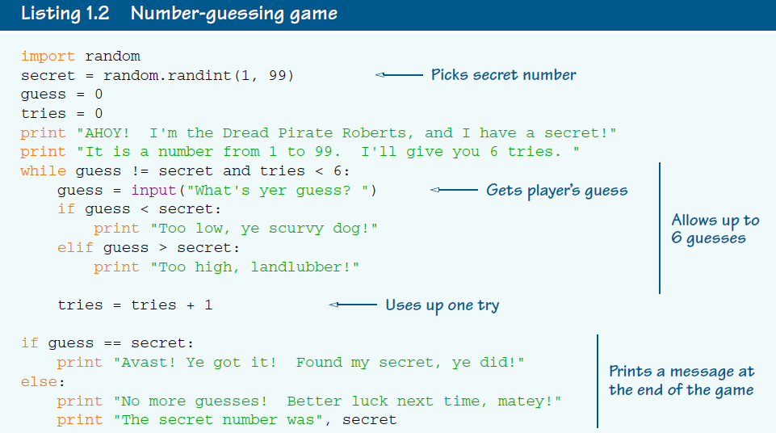
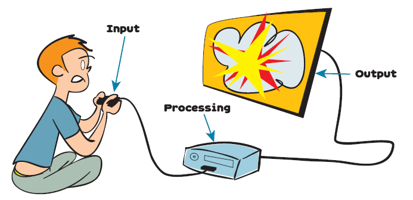
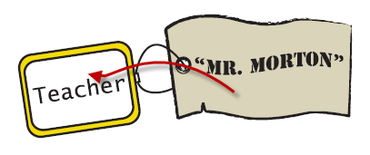
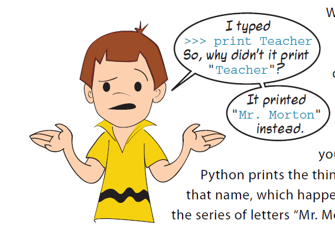
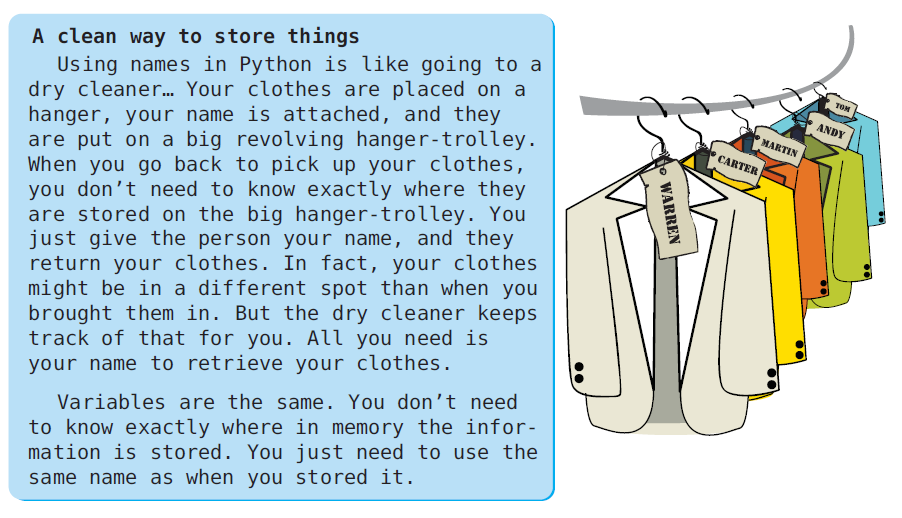
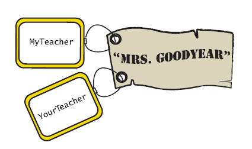

"""  
Created on Sat May 11 23:17:01 2019  
@author: molychin@qq.com  
programming_for_kids  
"""

## Computer Programming for Kids and Other Beginners-002

What is a program? Hey, wait a minute, I thought we answered that in chapter 1! We said a program was a series of instructions to the computer.  
什么是程序？嘿，等一下，我还以为我们在第一章就回答了呢！我们说一个程序是对计算机的一系列指令。

Well, that’s true. But almost all programs that do anything useful or fun have some other qualities:
■ They get input.  
■ They process the input.  
■ They produce output.  
嗯，那是真的。但是，几乎所有做任何有用或有趣的事情的程序都有一些其他的特性：  
■ 获取输入信息（数据）  
■ 处理输入信息（数据）  
■ 产生（生成）输出信息（数据）  



这个程序，具备了上述所有的元素（输入、处理、输出），有了相互的交流、对话，才能真正体现语言的魅力，才能说我们正在开始和计算机交朋友。  



如何让计算机记住你告诉他的信息呢？**神奇的“=”！**  
```python
>>>Teacher = "Mr. Morton"
>>>print (Teacher)
Mr. Morton
```
“=”的意思连小学生都知道，就是左右两边的值相等。**但是**，来到计算机的世界，这等号的含义就会有所不同，毕竟这是计算机的语言。等号的含义是将等号右边的值给予（复制到）左边的变量。也就是说让左边的变量记住右边的值。  




```python
>>>print ("53 + 28")
53 + 28
>>>print (53 + 28)
81
```
当打印输出时，放在引号内的东西会按照原样输出，否则的话，按照表达式的值输出。  
>名词解释：算术表达式、内存、变量、赋值、字符串



```python
>>> MyTeacher = "Mrs. Goodyear"
>>> YourTeacher = MyTeacher
>>> MyTeacher
"Mrs. Goodyear"
>>> YourTeacher
"Mrs. Goodyear"
```


可以将两个不同名变量指向同一个值，只是具有不同的名字罢了。就像在学校老师叫你“乐怡”`【正式名字】`，同学们叫你“乐子”`【外号】`，在家里叫你“Caca”`【昵称】`，其实这些不同的名字指向同一个你。

>了解变量的命名规则【不同的代码风格】  
变量名大小写敏感【至少Python是这样的，当然也有一些计算机语言是不区分大小写的。但总体上来说，这不是一种好的习惯。】


P23


sdfsdfgdfg
