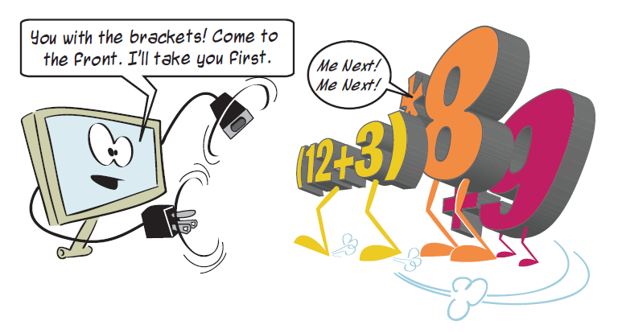
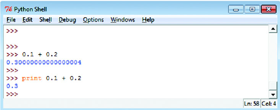
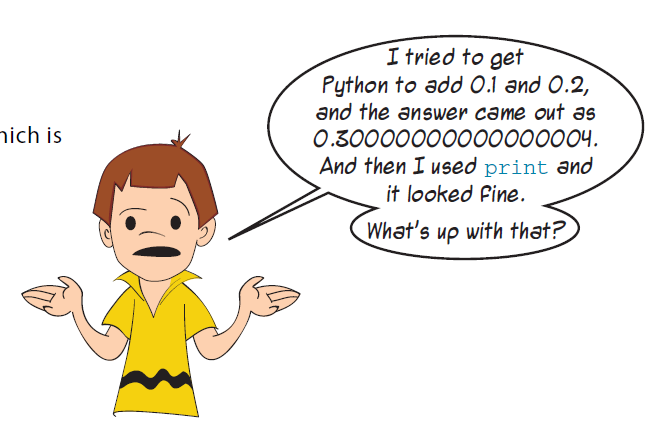
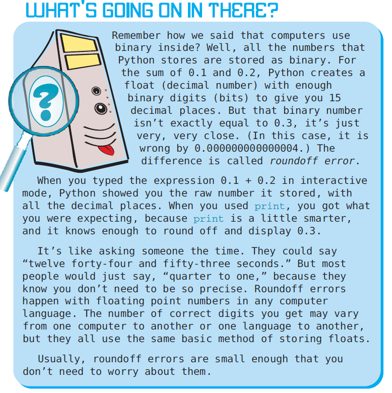
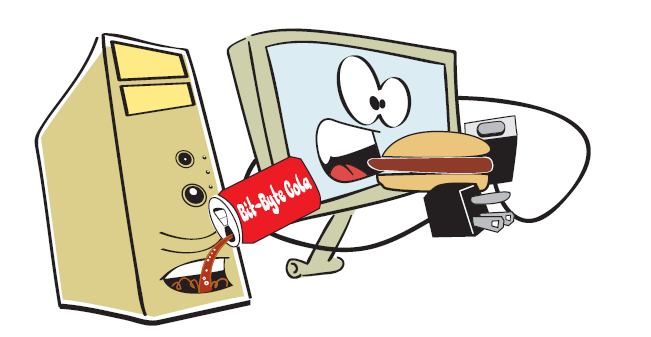

"""  
Created on Sat May 11 23:17:01 2019  
@author: molychin@qq.com  
programming_for_kids  
"""

## Computer Programming for Kids and Other Beginners-003

## Computer Programming for Kids and Other Beginners-004

>这里，我们会遇到计算机`出错`的场景，这是浮点数表示的系统误差造成的，详细说明其原理，需要花费不少精力。

## Computer Programming for Kids and Other Beginners-005

>continus....
